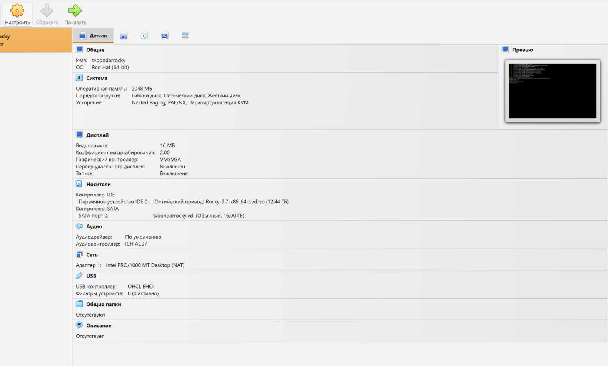
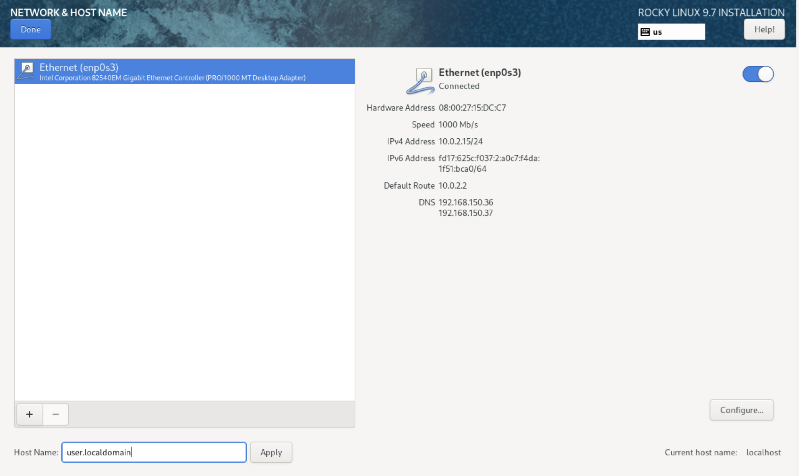
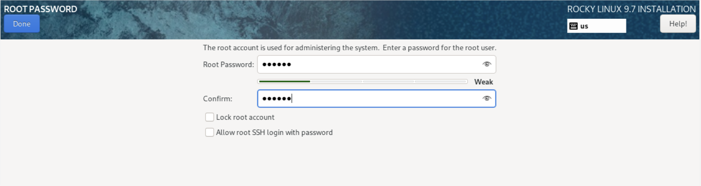

---
## Front matter
lang: ru-RU
title: Лабораторная работа No 1.
author:
  - Гасанова Ш. Ч.
institute:
  - Российский университет дружбы народов, Москва, Россия
date: 19 февраля 2026

## i18n babel
babel-lang: russian
babel-otherlangs: english

## Formatting pdf
toc: false
toc-title: Содержание
slide_level: 2
aspectratio: 169
section-titles: true
theme: metropolis
header-includes:
 - \metroset{progressbar=frametitle,sectionpage=progressbar,numbering=fraction}
 - '\makeatletter'
 - '\beamer@ignorenonframefalse'
 - '\makeatother'
---

## Цель работы

Целью данной работы является приобретение практических навыков установки операционной системы на виртуальную машину, настройки минимально необходимых для дальнейшей работы сервисов.

# Выполнение лабораторной работы

## Подготовка виртуальной машины к установке

1. Создадим виртуальную машину, в нее добавим 2 ядра, 4 гига. (к сожалению, без
   игровой видеокарты).

2. Добавим в нее раздел на 20 ГБ памяти, а также подключим iso образ инсталятора Rocky Linux.

3. Запустим и перейдем к установке.

## Установка Rocky Linux

1. Выбираем язык English и язык English (United States).

2. Выбираем автоматическую разметку диска.

## Установка Rocky Linux

3. Добавляем нового пользователя, учитывая соглашение об именовании.

{#fig:001 width=70%}

## Установка Rocky Linux

4. В предустанавливаемом ПО выбираем базовое окружение "Сервер с GUI" и группу "Developments tool".

{width=70%}

## Установка Rocky Linux

5. Отключаем kdump.

6. Выставляем пароль для рута.

7. Задаем hostname.

8. Запускаем установку.

## Установка Rocky Linux

9. Проверяем правильность установленного hostname и username (согласно соглашению об именовании).

{width=70%}

## Домашнее задание

{width=70%}

{width=70%}

## Домашнее задание

{width=70%}

{width=70%}

## Домашнее задание

{width=60%}

{width=50%}

## Выводы

По итогам выполнения работы, я настроила виртуальную машину с Rocky Linux.
